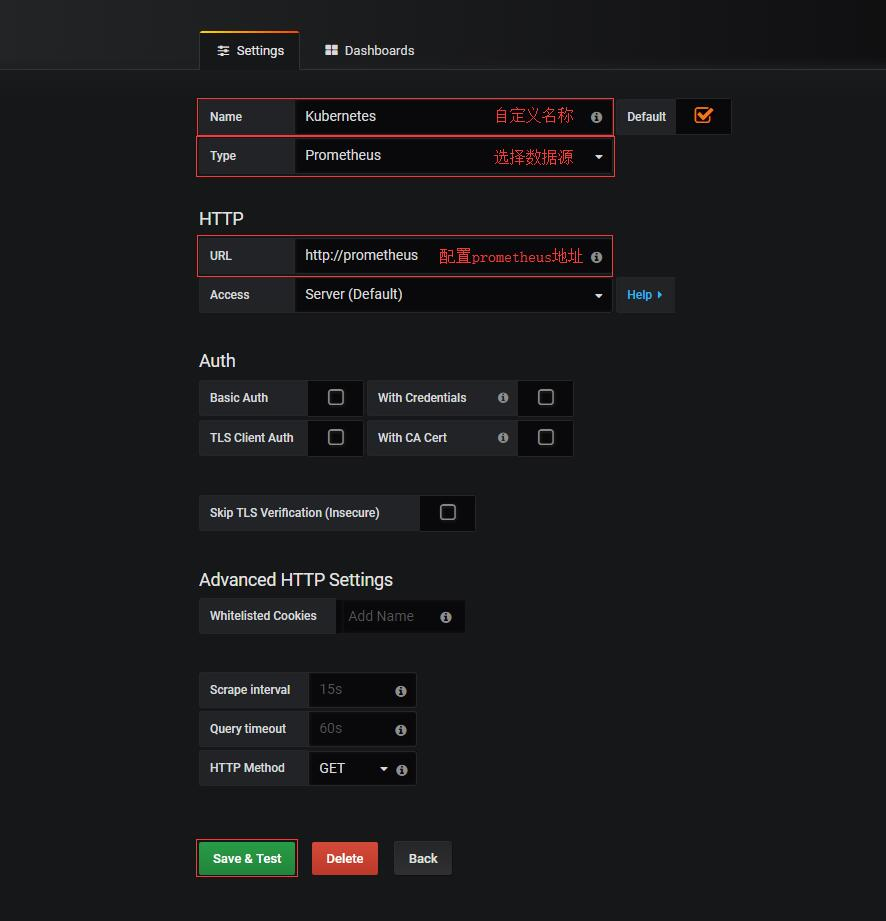

# 搭建Grafana服务

## 什么是Grafana?

Grafana是一个开源的指标量监测和可视化工具。常用于展示基础设施的时序数据和应用程序运行分析。
Grafana是根据查询条件设置聚合规则，在合适的图表上进行展示，多个图表共同组建成一个dashboard，如果熟悉kibana服务的话应该非常容易上手；值得一提的是Grafana的可视化功能非常强大。

## 部署Grafana服务

``` bash
# kubectl apply -f https://raw.githubusercontent.com/Donyintao/Grafana/master/grafana-deployment.yaml
# kubectl apply -f https://raw.githubusercontent.com/Donyintao/Grafana/master/grafana-ingress.yaml
```

## 配置Grafana服务

Grafana是一个度量仪表盘和图形编辑器的工具，主要通过dashboard配置和展示数据信息。
注意： 如果未设置匿名登录，可以通过浏览器访问`http://grafana.host.com`来登录`Grafana`服务，默认账号：`admin`默认密码：`admin`

添加Prometheus数据源，Grafana服务本身支持多种数据源。


导入Kubernetes监控模板，Grafana服务本身提供多种监控模板。[Grafana服务监控模板](https://grafana.com/dashboards)

